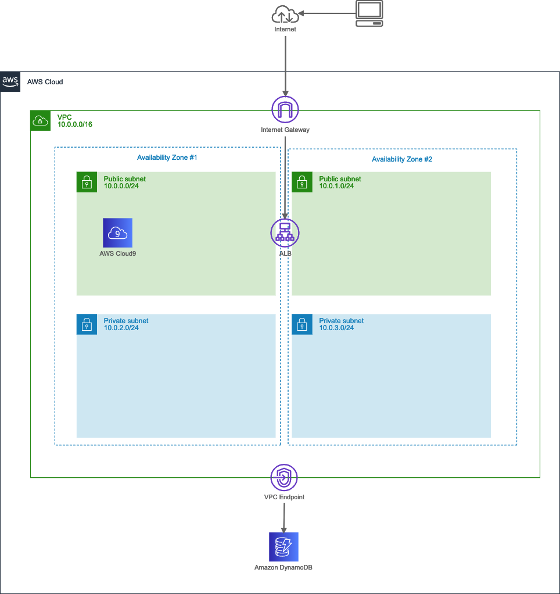
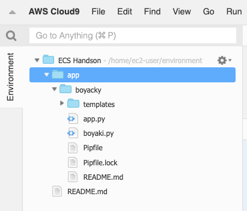
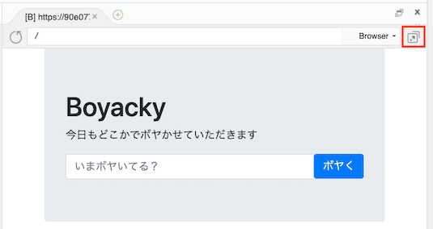
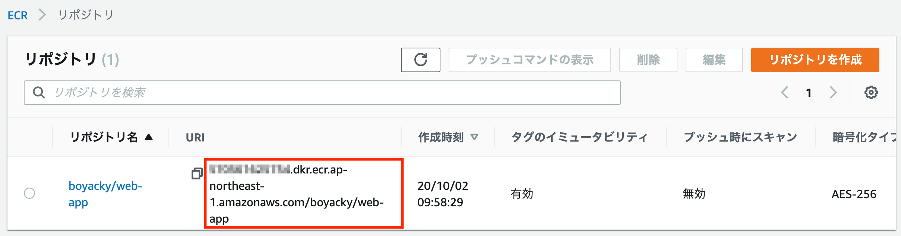
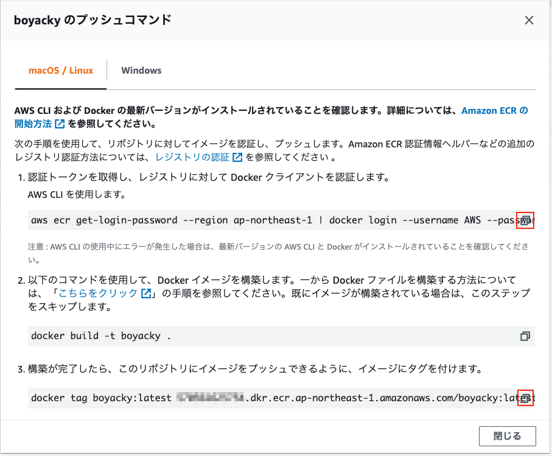
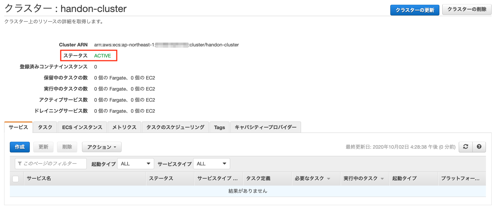

# ECSハンズオン - Module1

## はじめに
このハンズオンではAmazon ECS（以下、ECS）を使って、コンテナ用のサーバーレスコンピューティング環境であるAWS Fargate上にWebアプリケーションをデプロイします。

1. 関連リソースの構築
2. Webアプリケーションの実行
3. Dockerイメージの作成
4. DockerイメージをECRに登録
5. ECSの構築

```
handson-lb

* ターゲットの種類: IP
* ターゲットの登録
    * ネットワーク: vpc-0d4612f53fcf782ea
    * IP


```

## 1. 関連リソースの構築
ECSはVPC環境下で動くサービスです。
インターネットからアクセスするWebアプリケーションの場合、一般的に以下の構成になります。

* VPC
* サブネット
    * PublicとPrivateをそれぞれ2つずつ
* IGW
* ルートテーブル
    * PublicサブネットのデフォルトルートをIGWに設定
* セキュリティグループ
* ALB
    * LB、リスナー、ターゲットグループ作成
* ECR
    * 作成したコンテナをECRにPush
* CloudWatch Log Group
    * コンテナのログ出力先
* IAMロール

### 1.1 CloudFormationスタックの作成
CloudFormationを利用して、関連リソースの構築を自動で行います。
構築するAWSリソースは下記になります。



> 本ハンズオンは東京リージョン(ap-northeast-1)で行いますが、別リージョンでも構いません。その場合は適時読み替えてください。

1. CFテンプレート boyacky.yaml のダウンロード
2. CloudFormation コンソールからテンプレートファイルのアップロード

* 【課題】
    * boyacky.yamlの中身を確認してください。
    * 作成されたリソースを確認してください。
        * VPC IDをメモします。

### 1.2 Cloud9環境の起動
本ハンズオンでは作業環境を統一するためCloud9を利用します。
[Cloud9コンソール](https://ap-northeast-1.console.aws.amazon.com/cloud9/home)から`ECS Handson`環境を選択して、[Open IDE]ボタンを押下します。

しばらくするとCloud9の画面が表示されます。


上図はCloud9を利用してSSH経由でEC2環境に接続するイメージです。

* 【課題】
    * Cloud9ではよく使われるCLIがプリインストールされています。ターミナルで下記コマンドを実行してみてください。
        * git --version
        * docker --version
        * aws --version


## 2. Webアプリケーションの実行
Webアプリケーションをダウンロードして動作確認を行います。

### 2.1 Webアプリケーションのダウンロード
Cloud9上にWebアプリケーションのコードをダウンロードします。
Webアプリケーションは`serverworks-annex/boyacky`から取得可能です。

```
$ git clone https://github.com/serverworks-annex/boyacky.git
```

> UserId, Passwordトークンは別途ご連絡します。

Cloud9上のルートフォルダ`ECS Handson`内に`app`フォルダを作成し、端末側の`boyacky`フォルダをCloud9上のTreeビューappフォルダにドラッグ＆ドラッグします。



### 2.2 モジュールのインストール
Webアプリケーションに必要なパッケージをインストールします。

```
$ cd boyacky
$ pip install --user -r requirements.txt
```

### 2.3 Webアプリケーションのローカル実行
Webアプリケーションを実行します。

```
$ python app.py
 * Serving Flask app "app" (lazy loading)
 * Environment: production
   WARNING: This is a development server. Do not use it in a production deployment.
   Use a production WSGI server instead.
 * Debug mode: off
 * Running on http://0.0.0.0:8080/ (Press CTRL+C to quit)
```

Cloud9ツールバーの [Preview]-[Preview Running Application] を選択して内部ブラウザを表示します。



アドレスバー右側の [Pop Out Into New Window] ボタンを押下して別タブで表示します。


いくつかデータを登録して動きを確認してください。内部ブラウザのため、Postした後に画面がリフレッシュされません。Post後に内部ブラウザ左上のリロードボタンを押してリフレッシュしてください。

Webアプリケーションを終了する場合、シェルウィンドウ上で CTRL + C を押します。
仮想環境から抜ける場合は、exitを入力してEnterキーを押します。


* 【課題】
    * app.pyとboyaki.pyのソースコードを開いてロジックを確認してください。
    * templatesフォルダ内のhtmlを開いてレイアウトを確認してください。
    * DynamoDBコンソールで追加したデータを確認してください。


## 3. Dockerイメージの作成
WebアプリケーションのDockerイメージ（以下、イメージ）を作成します。
作成したイメージをCloud9上でコンテナ実行してDockerコマンドやライフサイクルを確認します。

Dockerを理解する上で、各コンポーネントとライフサイクルの関係を抑えておく必要があります。


| コンポーネント | 説明 |
|----|----|
| Dockerfile | Docker上で動作させるコンテナの構成情報を記述するためのファイル |
| イメージ | Dockerコンテナを構成するファイルシステムやメタ情報の集合体 |
| コンテナ | イメージを元に作成される仮想環境の実行部分 |
| レジストリ | イメージをホスティング、バージョン管理、配布するリポジトリ |

イメージの入手方法として2パターンあります。

* Dockerfileからからイメージを構築 (build)
* Dockerレジストリから取得 (pull)

Dockerレジストリは、Public/Privateに対応した[Docker Hub](https://hub.docker.com)やPrivate用の[Amazon ECR](https://aws.amazon.com/ecr)などがあります。

イメージは、isoファイルのように1ファイルで構成されているわけではなく、親子関係を持つ複数のレイヤーによって構成されています。


イメージとコンテナは1:Nの関係です。


#### イメージ管理用コマンド

| コマンド | 旧コマンド | 説明 |
|----|----|----|
| build | | Dockerfile からイメージを構築 |
| history | | イメージの履歴を表示 |
| import | | tar形式のファイルを読み込み、イメージを作成 |
| inspect | | イメージの詳細情報を表示 |
| load | | tar形式または標準入力からイメージを読み込む |
| ls	| images | イメージの一覧表示 |
| prune | - | 使用していないイメージを削除 |
| pull | | イメージをレジストリから取得 |
| push | | イメージをレジストリに送信 |
| rm | rmi | イメージを削除 |
| save | | イメージを tar 形式または標準出力にストリーム |
| tag | | イメージを参照する新しいタグを付ける |

#### コンテナ管理用コマンド

| コマンド | 旧コマンド | 説明 |
|----|----|----|
| attach	| | 実行中のコンテナにアタッチ |
| commit	| | コンテナに対する変更から新しいイメージを作成 |
| cp	| | コンテナとローカル間でファイルとディレクトリのコピー |
| create | | 新しいコンテナの作成 |
| diff | | イメージとコンテナの変更情報を調べる |
| exec | | 実行中のコンテナ内でコマンド実行 |
| export | | コンテナのファイルシステムをtarアーカイブ化 |
| inspect | | コンテナの詳細情報を表示 |
| kill | | コンテナのプロセスを停止(kill) |
| logs | | コンテナのログを表示 |
| ls | ps | コンテナ一覧の表示 |
| pause | | コンテナのプロセスを一時停止(pause) |
| port | | コンテナが使用しているポート情報の表示 |
| prune | - | 停止中の全コンテナを削除 |
| rename | | コンテナの名称を変更 |
| restart | | コンテナを再起動 |
| rm	| | コンテナの削除 |
| run | | 新しいコンテナを実行 |
| start | | 停止中のコンテナを起動 |
| stats | | コンテナのリソース使用状況を表示 |
| stop | | 実行中のコンテナを停止 |
| top | | コンテナが実行しているプロセスを表示 |
| unpause | | 一時停止中のコンテナを再開 |
| update | | コンテナの（リソース）設定を変更 |
| wait | | コンテナが停止するまで待機 |

* 【課題】
    * ターミナルから現在のイメージ一覧を確認してください。
        * 既にイメージがあります。これは何でしょうか？

### 3.1 Dockerfileの作成
boyackyフォルダ内にDockerfileを作成します。
Environmentビュー内の`boyacky`フォルダを右クリック、[New File]を選択します。
ファイル名を`Dockerfile`に変更します。

```
# 行コメント書けます
FROM python:alpine

WORKDIR /boyacky
COPY . /boyacky

RUN pip install flask==1.1.2
RUN pip install boto3==1.15.8
RUN pip install pynamodb==4.3.3

EXPOSE 8080

ENTRYPOINT ["python3"]
CMD ["-m", "app"]
```

ファイルの保存はエディタ上で [CMD] + [S] キーを押します。

| コマンド | 説明 |
|----|----|
| FROM | ベースのイメージを指定します。 |
| WORKDIR | |
| COPY | |
| RUN | イメージファイル作成時のコマンドを記入 |
| EXPOSE | コンテナ上でListenするポート番号を指定。 |
| ENTRYPOINT | |
| CMD | コンテナ起動時に実行するコマンドを指定 |

ENTRYPOINTはイメージの作成者側でコンテナの用途をある程度制限したい場合に利用します。


Dockerfileの詳しい書き方は、[Dockerfileリファレンス](http://docs.docker.jp/engine/reference/builder.html)を参照してください。

* 【課題】
    * Docker Hubから指定したベースのイメージとタグを検索してください。


### 3.2 Dockerイメージの作成
Dockerイメージの作成は`image build`コマンドを利用します。
Dockerfileがあるディレクトリをカレントディレクトリとして下記コマンドを実行します。

```
$ docker image build -t boyacky/web-app .
```

* **docker image build [オプション] Dockerfileのあるパス**
    * オプション
        * -t
            * イメージ名:タグ名を指定
            * イメージ名 (リポジトリ名)
                * 必須
                * 名前空間(/)を付けてリポジトリをカテゴリにグループ化が可能
                    * project/web-app
            * タグ名
                * 省略可能
                * 省略すると`latest`が付与
    * Dockerfileのあるパス
        * 必須
        * カレントディレクトリであれば`.`

> イメージ名:タグ名は省略可能で、その場合はイメージIDで識別します。
> しかし、人が判断する場合は何のイメージか識別しにくいため、必ず付けるようにしましょう。

* 【課題】
    * `image build`コマンドの実行結果ログから何が行われたを確認してください。
    * 現在のイメージ一覧を確認してください。何が追加されたかを確認します。

### 3.3 コンテナの起動
作成したDockerイメージをCloud9上で起動します。
下記のコマンドを実行します。

```
$ docker container run -d -p 8080:8080 boyacky/web-app
```

* **docker container run [オプション] イメージ [コマンド]**
    * オプション
        * -d
            * デタッチモード (コンテナの実行をバックグラウンドで行う)
            * Webアプリケーションは基本デタッチモード
        * -p
            * コンテナのポートをホストに公開 (コンテナ間通信では不要)
            * ホストのポート番号:コンテナのポート番号
    * イメージ
        * イメージ名:タグ名 または イメージID
        * イメージIDは一意であれば途中から省略可能

Cloud9の内部ブラウザでWebアプリケーションのトップページが表示されることを確認をします。

コンテナで起動したWebアプリケーションはAWSへの権限がなくDynamoDBに接続できません。  
Cloud9はデフォルトで、AWS Managed Temporary Credentials (AMTC) が有効になっています。Cloud9起動時にAWSマネジメントコンソールへログインしたユーザーと同等の権限をもつ一時クレデンシャルキーが自動で発行されています。しかしDockerコンテナ内へは引き継ぎされないため、クレデンシャル情報を環境変数から渡すなどの工夫が必要です。


### 3.4 コンテナ内の確認
起動中のコンテナ一を確認します。

```
$ docker container ls
```

コンテナ内のシェルに入ります。

```
$ docker exec -it f6d522ccc508 /bin/sh
```

* **docker container exec [オプション] コンテナID コマンド**
    * オプション
        * -it
    * コンテナID
    * コマンド


不要なファイルが入っています。


### 3.5 Dockerイメージの再作成


.dockerignore

```
.git
.vscode
__pycache__
README.md
requirements.txt
```

Dockerイメージを再作成します。

```
$ docker build -t boyacky/web-app .
```

* 【課題】
    * `image ls`コマンドで以前作成したイメージを確認してください。
    * `docker container run -d -p 8080:8080 -t boyacky/web-app`を実行してエラー結果を確認してください。


```
$ docker container run -d -p 8080:8080 -t boyacky/web-app
```


docker container run -d -p 8080:8081 -t boyacky/web-app


* 【課題】
    * inspectコマンドでイメージの詳細情報を確認してください。
        * レイヤーの数はいくつか
        * 各レイヤーのフォルダパスはどこか
    * イメージの実態があるフォルダパスを探索します。
        * sudo su でルートユーザーにスイッチ


## 4. DockerイメージをECRに登録
ECSで

### 4.1 Amazon ECRにリポジトリを作成
[ECRコンソール](https://ap-northeast-1.console.aws.amazon.com/ecr)から[Repositories]を選択し、[リポジトリを作成]ボタンを押下します。

* リポジトリのアクセスとタグ
    * リポジトリ名
        * `boyacky/web-app`
    * タグのイミュータビリティ
        * `有効`

画面右下の[リポジトリを作成]ボタンを押下します。

タグのイミュータビリティを有効にすると、タグの上書きを禁止できます。
ソースコードとコンテナイメージの一貫性の把握が容易

* オプション
    * --repository-name
        * リポジトリ名を指定。必須項目
        * 名前空間(/)を付けてリポジトリをカテゴリにグループ化が可能
            * project/web-app
    * --image-tag-mutability
        * イメージのタグを上書き可能かどうかを設定
        * `MUTABLE`
            * タグの上書きが可能
            * 省略した場合のデフォルト値
            * latestタグでの運用が可能る
        * `IMMUTABLE`
            * タグの上書きを禁止
            * latestタグでの運用は出来ない
            * ソースコードとコンテナイメージの一貫性の把握が容易
    * --image-scanning-configuration
        * scanOnPush
            * プッシュ時にスキャンします。



作成したリポジトリURIは、この後のタスク定義で利用します。コピーして控えてください。


### 4.2 Amazon ECR にDockerイメージを登録
3.2で作成したDockerイメージをECRに登録します。
DockerクライアントはデフォルトでDocker Hubレジストリのみに対応しているため、ECRへ接続できるように認証トークンを利用してDockerクライアントを認証します。

作成したリポジトリを選択して、[プッシュコマンドの表示]ボタンを押下します。



プッシュコマンドの手順を見ながらECRへプッシュします。

#### 1. 認証トークンを取得してレジストリに対して Dockerクライアントを認証

コマンド右側の[コピー]ボタンを押下してクリップボードにコピーして、Cloud9上のシェルにペーストして実行します。

```
$ aws ecr get-login-password --region ap-northeast-1 | docker login --username AWS --password-stdin xxxxxxxxxxxx.dkr.ecr.ap-northeast-1.amazonaws.com
Login Succeeded
```

コンソールの最後に`Login Succeeded`が表示されれば成功です。WARNINGが出た場合は無視してください。

2つのコマンドをパイプ処理で繋げています。

* aws ecr get-login-password
    * AWS CLIコマンドを利用してECRから認証トークンを取得します。
* docker login
    * --password-stdin で標準入力から認証トークンを受け取ります。

#### 2. Dockerイメージを構築 
既に3.2でDockerイメージを作成したのでスキップします。

* 作成済みのイメージ
    * boyacky/web-app:latest

#### 3. イメージにタグを付け
**【重要】DockerイメージをECRへ登録する場合、クライアント側のイメージ名はECR側のリポジトリURIと一致する必要があります。**


そのため、作成済みのイメージにタグを付けてエイリアスを作成します。

```
$ docker tag boyacky/web-app:latest xxxxxxxxxxxx.dkr.ecr.ap-northeast-1.amazonaws.com/boyacky/web-app:1.0
```

> docker tag 元イメージ名[:タグ] 新イメージ名[:タグ]

ECR上のリポジトリは、タグのイミュータビリティを有効にしたので、新イメージ名側のタグは`latest`ではなく`1.0`にします。

* 【課題】
    * ターミナルから現在のイメージ一覧を確認してください。
        * タグ付けしたイメージがあることを確認します。
        * `boyacky/web-app:latest`とイメージIDが同じことを確認します。

#### 4. イメージを登録
最後にイメージをECRへ登録します。

```
$ docker push xxxxxxxxxxxx.dkr.ecr.ap-northeast-1.amazonaws.com/boyacky/web-app:1.0
```

ECR側のリポジトリURIと一致しない場合、リクエストは拒否されて下記のメッセージが表示されます。

> denied: requested access to the resource is denied

* 【課題】
    * ECRコンソールで登録したイメージを確認してください。


## 5. ECSの構築

### 5.1 ECSクラスターを作成

ECSコンソールから[クラスター]を選択し、[クラスターの作成]ボタンを押下します。

1. クラスターテンプレートの選択
    * [ネットワーキングのみ]を選択して[次のステップ]ボタンを押下
2. クラスターの設定
    * クラスター名
        * handon-cluster 
    * [作成]ボタンを押下
3. [クラスターの表示]ボタンを押下

>【重要】  
> ECSクラスター自体に料金は発生しません。これに対して、EKSクラスターは毎時 0.10USDの料金が発生します。

クラスターの詳細画面が表示されます。ステータスは`ACTIVE`の状態です。




### 5.2 タスク定義の作成
ECSコンソールから[タスク定義]を選択し、[新しいタスク定義の作成]ボタンを押下します。

#### 1. 起動タイプの互換性の選択
`FARGATE`を選択して[次のステップ]ボタンを押下します。

#### 2. タスクとコンテナの定義の設定

* タスク定義名
    * `boyacky-taskdef`
* タスクロール
    * `なし`
* タスクの実行IAMロール
    * タスク実行ロール
        * `新しいロールの作成`
* タスクサイズ
    * タスクメモリ (GB)
        * `0.5GB`
    * タスクCPU (vCPU)
        * `0.25 vCPU`
* コンテナの定義
    * [コンテナの追加]ボタンを押下

##### コンテナの追加
[コンテナの追加]用のポップアップウインドウが表示されます。

* スタンダード
    * コンテナ名
        * `boyacky-container`
    * イメージ
        * `xxxxxxxxxxxx.dkr.ecr.ap-northeast-1.amazonaws.com/boyacky/web-app`
        * 4.1でコピーしたリポジトリURIをペースト
    * ポートマッピング
        * `8080`

ポップアップウインドウ最下部の[追加]ボタンを押下します。

ポップアップウインドウが閉じて、タスク定義画面のコンテナの定義に追加されます。

画面最下部の[作成]ボタンを押下します。

[タスク定義の表示]ボタンを押下して、タスク定義の詳細画面を表示します。


### 5.3 サービスの作成
[アクション]ボタンから[サービスの作成]を選択します。

* ステップ1: サービスの設定
    * 起動タイプ
        * `FARGATE`
    *  サービス名
        * `boyacky-service`
    * タスクの数
        * `1`
    * [次のステップ]ボタンを押下
* ステップ2: ネットワーク構成
    * クラスターVPC
        * 1.1で作成したVPCを選択
    * サブネット
        * 1.1で作成したPrivateサブネットを2つ選択
    * セキュリティグループ
        * 1.1で作成した`handson_web_sg`
    * ロードバランシング
        * Application Load Balancer
    * [次のステップ]ボタンを押下
* ステップ3: Auto Scaling (オプション)
    * Service Auto Scaling
        * サービスの必要数を直接調整しない
    * [次のステップ]ボタンを押下
* ステップ4: 確認
    * [サービスの作成]ボタンを押下


